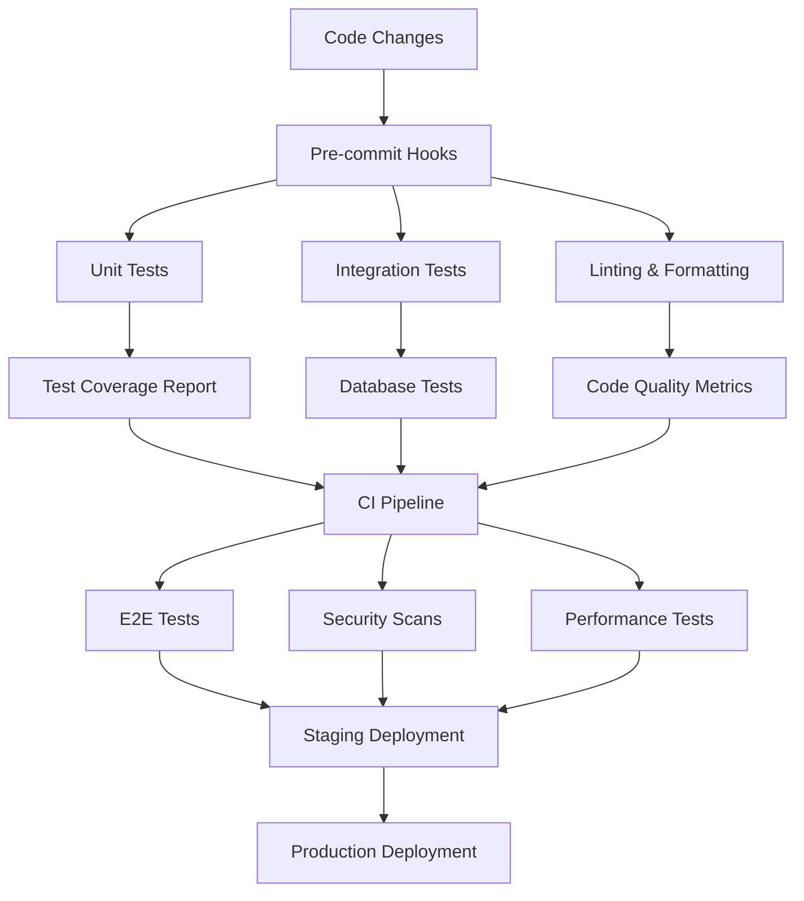
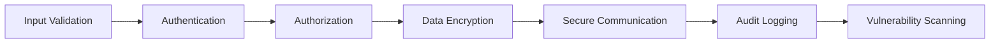

# Comprehensive Quality Assurance Design Document

## Overview

This design document outlines the implementation strategy for a comprehensive quality assurance system for the RentaFlux application. The system will integrate testing frameworks, security tools, performance monitoring, and code quality measures to ensure a production-ready application.

## Architecture

### Testing Architecture



### Security Architecture



## Components and Interfaces

### 1. Testing Framework Components

#### Unit Testing Infrastructure
- **Framework**: Vitest (fast, TypeScript-native)
- **Mocking**: vi.mock for service mocking
- **Coverage**: c8 for code coverage reporting
- **Location**: `src/__tests__/unit/`

```typescript
// Example test structure
interface TestSuite {
  describe: string;
  tests: TestCase[];
  setup?: () => void;
  teardown?: () => void;
}

interface TestCase {
  name: string;
  test: () => Promise<void> | void;
  timeout?: number;
}
```

#### Integration Testing Infrastructure
- **Framework**: Vitest with Supabase test client
- **Database**: Test database with migrations
- **Location**: `src/__tests__/integration/`

#### End-to-End Testing Infrastructure
- **Framework**: Playwright
- **Browser**: Chromium, Firefox, Safari
- **Location**: `e2e/`

### 2. Security Components

#### Input Validation Service
```typescript
interface ValidationService {
  sanitizeInput(input: string): string;
  validateEmail(email: string): boolean;
  validatePhone(phone: string): boolean;
  validateUUID(id: string): boolean;
  escapeHtml(html: string): string;
}
```

#### Authentication Security
```typescript
interface SecurityConfig {
  sessionTimeout: number;
  maxLoginAttempts: number;
  passwordRequirements: PasswordPolicy;
  jwtConfig: JWTConfig;
}
```

#### Audit Logging Service
```typescript
interface AuditLogger {
  logUserAction(userId: string, action: string, details: object): void;
  logDataAccess(userId: string, table: string, operation: string): void;
  logSecurityEvent(event: SecurityEvent): void;
}
```

### 3. Performance Monitoring Components

#### Performance Metrics Collector
```typescript
interface PerformanceMetrics {
  responseTime: number;
  memoryUsage: number;
  cpuUsage: number;
  databaseQueryTime: number;
  cacheHitRate: number;
}
```

#### Load Testing Configuration
```typescript
interface LoadTestConfig {
  maxUsers: number;
  rampUpTime: number;
  testDuration: number;
  endpoints: EndpointConfig[];
}
```

### 4. Code Quality Components

#### ESLint Configuration Enhancement
```typescript
interface ESLintConfig {
  extends: string[];
  rules: Record<string, any>;
  plugins: string[];
  overrides: Override[];
}
```

#### Documentation Generator
```typescript
interface DocumentationConfig {
  apiDocs: boolean;
  componentDocs: boolean;
  serviceDocs: boolean;
  outputFormat: 'html' | 'markdown';
}
```

## Data Models

### Test Results Schema
```sql
CREATE TABLE test_results (
  id UUID PRIMARY KEY,
  test_suite VARCHAR(255) NOT NULL,
  test_name VARCHAR(255) NOT NULL,
  status VARCHAR(50) NOT NULL,
  duration_ms INTEGER,
  error_message TEXT,
  created_at TIMESTAMP DEFAULT NOW()
);
```

### Security Audit Schema
```sql
CREATE TABLE security_audits (
  id UUID PRIMARY KEY,
  scan_type VARCHAR(100) NOT NULL,
  severity VARCHAR(50) NOT NULL,
  vulnerability_type VARCHAR(100),
  description TEXT,
  file_path VARCHAR(500),
  line_number INTEGER,
  fixed BOOLEAN DEFAULT FALSE,
  created_at TIMESTAMP DEFAULT NOW()
);
```

### Performance Metrics Schema
```sql
CREATE TABLE performance_metrics (
  id UUID PRIMARY KEY,
  endpoint VARCHAR(255) NOT NULL,
  response_time_ms INTEGER NOT NULL,
  memory_usage_mb DECIMAL(10,2),
  cpu_usage_percent DECIMAL(5,2),
  timestamp TIMESTAMP DEFAULT NOW()
);
```

## Error Handling

### Error Classification System
```typescript
enum ErrorSeverity {
  LOW = 'low',
  MEDIUM = 'medium',
  HIGH = 'high',
  CRITICAL = 'critical'
}

interface ErrorHandler {
  handleError(error: Error, severity: ErrorSeverity): void;
  logError(error: Error, context: object): void;
  notifyAdministrators(error: CriticalError): void;
}
```

### Error Recovery Strategies
1. **Network Errors**: Exponential backoff retry
2. **Database Errors**: Connection pooling and failover
3. **Validation Errors**: User-friendly messages
4. **Authentication Errors**: Secure session handling
5. **Authorization Errors**: Proper access control

## Testing Strategy

### Unit Testing Strategy
- **Coverage Target**: 90% code coverage
- **Test Types**: 
  - Service layer tests
  - Utility function tests
  - Component logic tests
  - Hook tests

### Integration Testing Strategy
- **Database Integration**: Test with real Supabase instance
- **API Integration**: Test service-to-service communication
- **Authentication Integration**: Test auth flows
- **Payment Integration**: Test Stripe integration

### End-to-End Testing Strategy
- **User Workflows**: Complete user journeys
- **Cross-browser Testing**: Chrome, Firefox, Safari
- **Mobile Testing**: Responsive design validation
- **Performance Testing**: Load time validation

### Performance Testing Strategy
- **Load Testing**: Simulate concurrent users
- **Stress Testing**: Test system limits
- **Spike Testing**: Test sudden load increases
- **Volume Testing**: Test with large datasets

### Security Testing Strategy
- **OWASP Top 10**: Test against common vulnerabilities
- **Input Validation**: Test injection attacks
- **Authentication**: Test session security
- **Authorization**: Test access controls
- **Data Protection**: Test encryption

### Accessibility Testing Strategy
- **Automated Testing**: axe-core integration
- **Manual Testing**: Screen reader testing
- **Keyboard Navigation**: Tab order validation
- **Color Contrast**: WCAG compliance
- **Focus Management**: Proper focus handling

## Implementation Phases

### Phase 1: Foundation Setup (Week 1-2)
1. Install and configure testing frameworks
2. Set up CI/CD pipeline
3. Implement basic security measures
4. Create project documentation structure

### Phase 2: Core Testing Implementation (Week 3-4)
1. Write unit tests for all services
2. Implement integration tests
3. Set up end-to-end testing framework
4. Create performance testing suite

### Phase 3: Security Hardening (Week 5-6)
1. Implement comprehensive input validation
2. Set up security scanning tools
3. Enhance authentication and authorization
4. Implement audit logging

### Phase 4: Performance Optimization (Week 7-8)
1. Implement performance monitoring
2. Optimize database queries
3. Implement caching strategies
4. Bundle optimization

### Phase 5: Quality Assurance (Week 9-10)
1. Code quality improvements
2. Documentation completion
3. Accessibility compliance
4. Final security audit

### Phase 6: Monitoring & Maintenance (Week 11-12)
1. Set up production monitoring
2. Implement alerting systems
3. Create maintenance procedures
4. Team training and handover

## Tools and Technologies

### Testing Tools
- **Unit Testing**: Vitest
- **Integration Testing**: Vitest + Supabase Test Client
- **E2E Testing**: Playwright
- **Performance Testing**: Artillery.io
- **Security Testing**: OWASP ZAP, Snyk
- **Accessibility Testing**: axe-core, Pa11y

### Code Quality Tools
- **Linting**: ESLint with TypeScript rules
- **Formatting**: Prettier
- **Type Checking**: TypeScript strict mode
- **Documentation**: TypeDoc, JSDoc
- **Coverage**: c8

### Security Tools
- **Vulnerability Scanning**: Snyk, npm audit
- **Static Analysis**: SonarQube
- **Dependency Checking**: audit-ci
- **Secret Scanning**: GitLeaks

### Performance Tools
- **Monitoring**: Sentry, LogRocket
- **Analytics**: Google Analytics 4
- **Performance**: Lighthouse CI
- **Load Testing**: Artillery.io

### CI/CD Tools
- **Pipeline**: GitHub Actions
- **Deployment**: Vercel/Netlify
- **Monitoring**: Uptime Robot
- **Notifications**: Slack/Discord webhooks

## Success Metrics

### Testing Metrics
- Code coverage: >90%
- Test execution time: <5 minutes
- Test reliability: >99% pass rate
- Bug detection rate: >95%

### Security Metrics
- Vulnerability count: 0 high/critical
- Security scan frequency: Daily
- Incident response time: <1 hour
- Compliance score: 100%

### Performance Metrics
- Page load time: <2 seconds
- API response time: <200ms
- Lighthouse score: >90
- Uptime: >99.9%

### Quality Metrics
- ESLint violations: 0
- TypeScript errors: 0
- Documentation coverage: >80%
- Code maintainability index: >70

This comprehensive design ensures that the RentaFlux application will meet enterprise-grade quality, security, and performance standards while maintaining developer productivity and code maintainability.